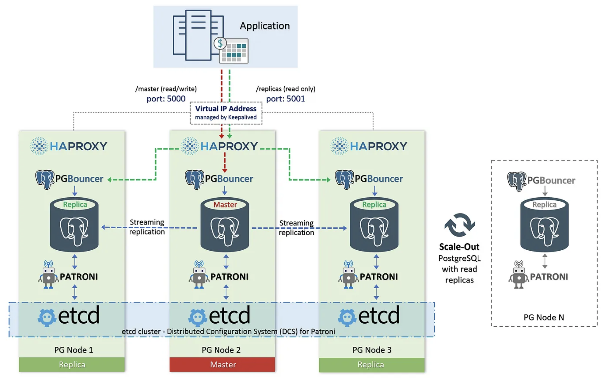

# High Availability PostgreSQL Cluster with Patroni, Etcd, HAProxy, PGTune, and TimescaleDB

## 🧠 Project Overview

This project showcases a **production-grade High Availability PostgreSQL cluster** setup featuring:

- ✅ **Patroni** for PostgreSQL failover and orchestration
- ✅ **Etcd** for distributed configuration and consensus
- ✅ **HAProxy** for load balancing and health checks
- ✅ **PGTune** to automatically tune PostgreSQL configuration
- ✅ **TimescaleDB** for efficient handling of time-series data
- ✅ **Autobase**, a custom internal dashboard for monitoring the cluster

---

## 🎯 Business Problem

The organization faced:

- Unplanned PostgreSQL outages
- Limited scalability and performance bottlenecks under load
- Difficulty managing time-series data
- No unified visibility into database cluster state

---

## 💡 Solution Value

By implementing this HA architecture, the system delivers:

| Feature                          | Business Value                                              |
|----------------------------------|-------------------------------------------------------------|
| Automatic Failover               | Continuous availability with no manual intervention         |
| Read-Replica Load Balancing      | Efficient read scalability                                  |
| PGTune Optimization              | Boosted performance based on available resources            |
| TimescaleDB                      | Advanced time-series data handling for logs & metrics       |
| Autobase Dashboard               | Improved developer and SRE insight into DB state            |

> 🔄 Result: Reduced incidents, faster query performance, and better SLO adherence.

---

## 🧱 Architecture Diagram

    All nodes coordinate via Etcd and use PGTune-optimized configs.

    HAProxy routes to primary/replica nodes.

    Autobase shows live cluster and DB status.

---
## ⚙️ Tech Stack

| Component     | Description                       |
| ------------- | --------------------------------- |
| Patroni       | HA orchestrator for PostgreSQL    |
| PostgreSQL 16 | Database engine                   |
| Etcd          | DCS backend for Patroni           |
| HAProxy       | TCP load balancer for DB routing  |
| PGTune        | PostgreSQL configuration tuning   |
| TimescaleDB   | Time-series PostgreSQL extension  |
| Autobase      | Internal dashboard for visibility |

---

## 🔧 Setup Overview

### 1. 🗃️ Etcd Setup
- Installed and clustered on all nodes

- Peer communication via initial-cluster and ETCDCTL_API=3

### 2. 🐘 PostgreSQL + Patroni Installation
- Installed PostgreSQL 16 from PGDG

- Patroni configured to use:

        Etcd for DCS
        REST API on port 8008
        Auto-bootstrap if no leader exists

### 3. ⚙️ PGTune for Performance

- Generated optimized configs using pgtune.leopard.in.ua

- Updated postgresql.conf values via Patroni

- Key parameters tuned:

        max_connections = 200
        shared_buffers = 16GB
        effective_cache_size = 48GB
        maintenance_work_mem = 2GB
        checkpoint_completion_target = 0.9
        wal_buffers = 16MB
        default_statistics_target = 100
        random_page_cost = 1.1
        effective_io_concurrency = 200
        work_mem = 72315kB
        huge_pages = try
        min_wal_size = 1GB
        max_wal_size = 4GB
        max_worker_processes = 32
        max_parallel_workers_per_gather = 4
        max_parallel_workers = 32
        max_parallel_maintenance_workers = 4

> 🔧 Result: 15–30% improvement in query execution under load

### 4. 📈 TimescaleDB Extension

- Installed TimescaleDB on all nodes

- Loaded via:

        CREATE EXTENSION IF NOT EXISTS timescaledb;

- Enabled automatic chunking and compression for telemetry and metrics tables

> 🧠 Use case: Efficient ingestion and querying of IoT, system, and application metrics

### 5. ⚖️ HAProxy Configuration

- Health check endpoints used:

        GET /master for primary

        GET /replica for read replicas

- Two listeners:

        5000: RW (primary)

        6000: RO (replica)

---

## 🧪 Testing & Validation

1. Simulated master failure —> automatic failover

2. Confirmed read queries route to replicas on port 6000

3. Benchmarked query performance with/without PGTune

4. Time-series inserts tested on Timescale hypertables

---

##  Key Takeaways

- Built a resilient, tunable PostgreSQL system with automatic healing

- Tuned PostgreSQL to hardware using PGTune

- Leveraged TimescaleDB to enable time-series workloads

- Created full end-to-end visibility with Autobase

---

## 🚀 Future Enhancements

- TLS for HAProxy and PostgreSQL

- Automatic daily backups and WAL archiving

- Grafana integration via Timescale

- Ansible-based deployment

