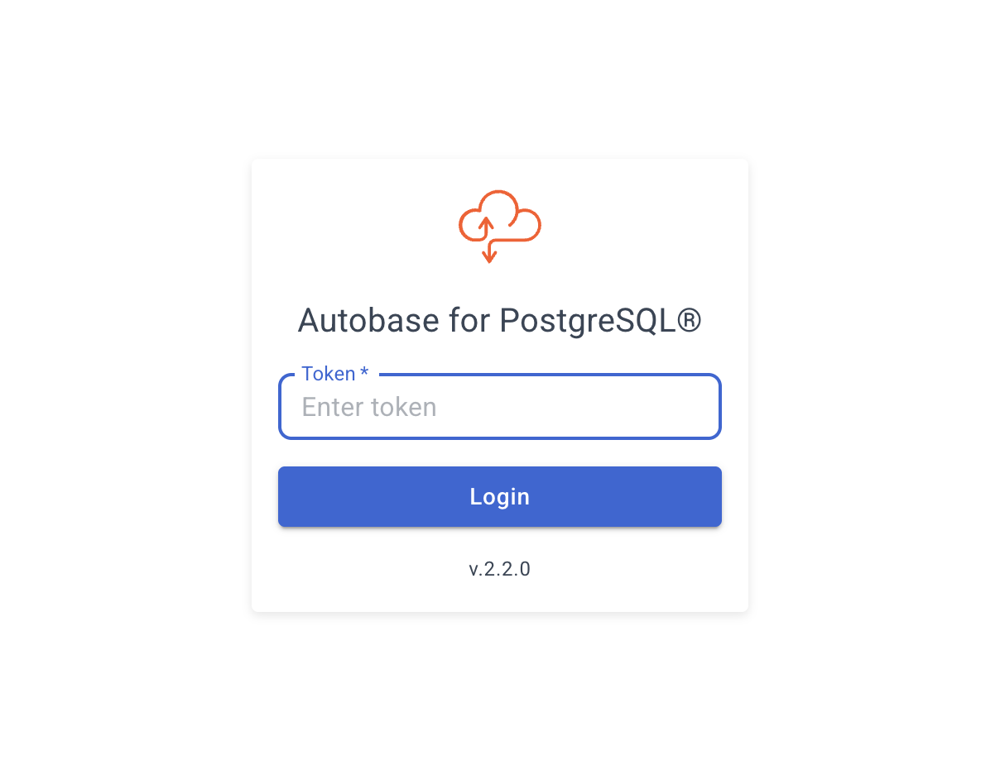
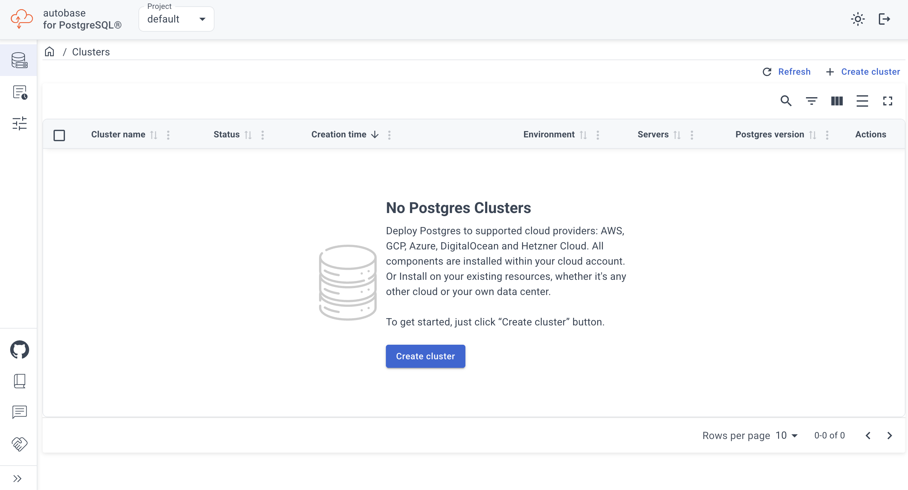
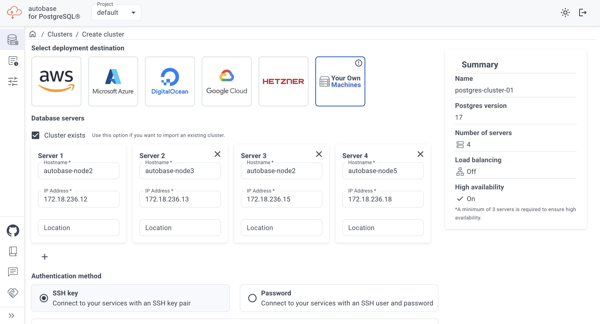
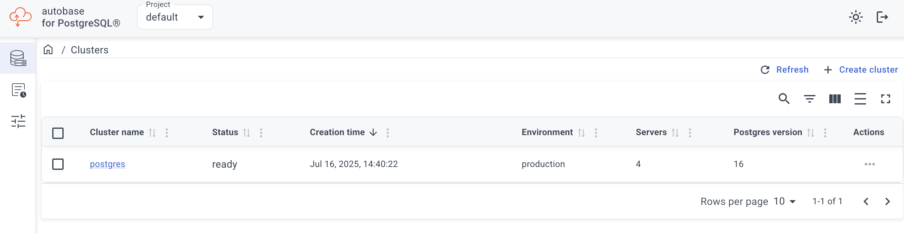
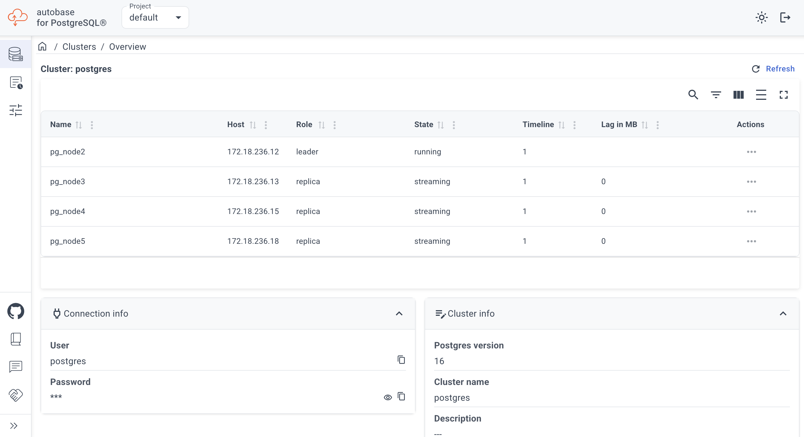
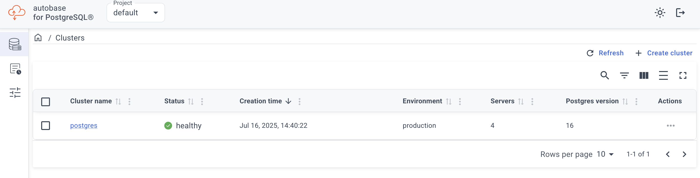

# Autobase Setup Guide

## Prerequisites

- [Docker](https://www.docker.com/) must be installed on your system.

## Introduction

Autobase simplifies the setup and management of database clusters with automatic failover capabilities.

You can use Autobase in two scenarios:
- **Connect to an existing cluster:** Integrate Autobase with your current Patroni PostgreSQL cluster.
- **Deploy a new cluster:** Set up a new database cluster using Autobase.

> **Note:** The following instructions assume you already have a Patroni PostgreSQL cluster configured.

## Screenshots

| Main View | Dashboard | Cluster Setup |
|-----------|-----------|---------------|
|  |  |  |

| Cluster Overview | Setup Process | Cluster Status |
|------------------|--------------|---------------|
|  |  |  |

> **Disclaimer:** Cluster configuration changes are currently supported only via the command line.
