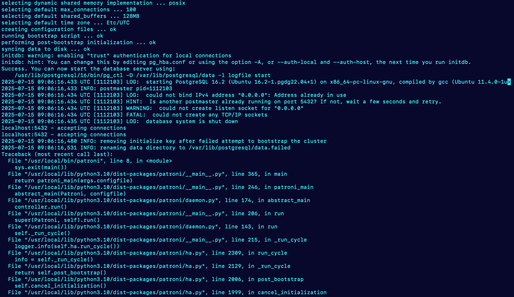
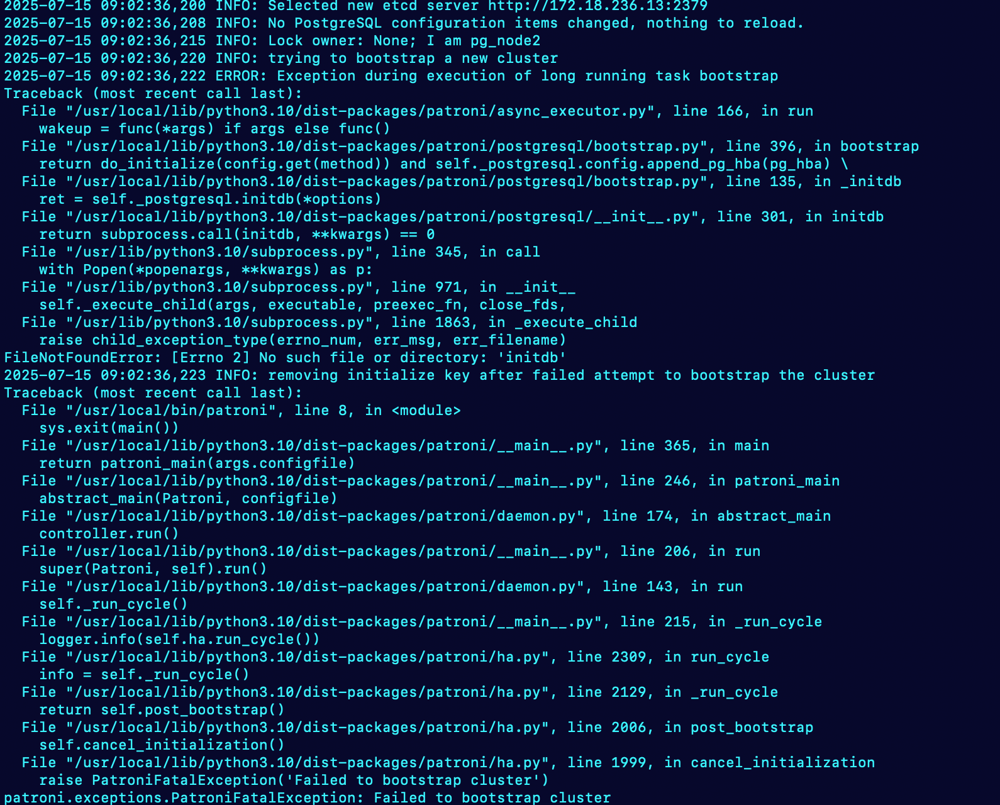
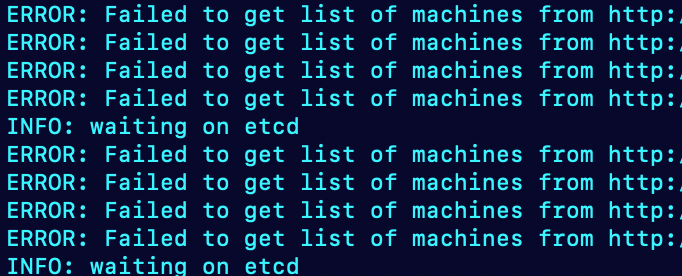
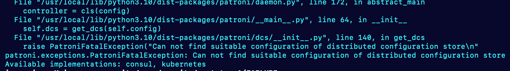

# Errors Encountered and Solutions

This document lists common errors encountered during Patroni AutoFailover setup and their respective solutions.

---

## Error 1: Address Already in Use



```
could not bind IPv4 address "0.0.0.0": Address already in use
FATAL:  could not create any TCP/IP sockets
```

**Solution:**

Stop any running PostgreSQL service, re-execute the systemd manager, and restart Patroni:

```sh
sudo systemctl stop postgresql
sudo systemctl daemon-reexec
sudo systemctl restart patroni
sudo systemctl status patroni
sudo systemctl start postgresql
```

---

## Error 2: `initdb` Not Found



```
FileNotFoundError: [Errno 2] No such file or directory: 'initdb'
```

**Solution:**

1. Find the PostgreSQL binaries directory:

    ```sh
    pg_config --bindir
    ```

2. Add the output path to your Patroni YAML configuration:

    ```yaml
    data_dir: /var/lib/postgresql/data
    bin_dir: /usr/lib/postgresql/16/bin
    ```

---

## Error 3: Etcd API Version Mismatch



```
ERROR: Failed to get list of machines from http://x.x.x.x:2379/v2: EtcdException('Bad response : 404 page not found\n')
```

**Solution:**

Ensure the etcd API version matches the version expected by Patroni.

---

## Error 4: Patroni Cannot Find Suitable Distributed Configuration Store



```
patroni.exceptions.PatroniFatalException: Can not find suitable configuration of distributed configuration store
patroni[1111856]: Available implementations: consul, kubernetes
```

**Solution:**

1. Remove any incompatible etcd Python packages and install the correct ones:

    ```sh
    sudo pip uninstall python-etcd
    pip install etcd3
    sudo pip install etcd3gw
    pip list | grep etcd
    ```

2. Reinstall Patroni with etcd support:

    ```sh
    pip uninstall patroni
    sudo pip uninstall patroni
    pip install patroni[etcd]
    sudo pip install patroni[etcd]
    ```

> **Note:** Installing with `[etcd]` ensures Patroni has etcd3gw support.

---
